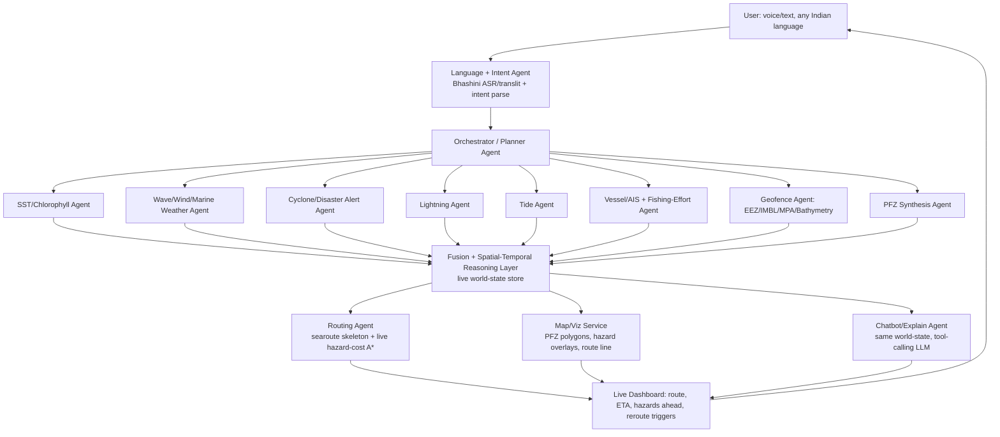

# ORCA — Marine EcOsystem Reasoning with Collaborative Agents

**SIH 2026 · ISRO/Dept. of Space · Software · Disaster Management**
Team target: agentic, conversational, geospatial decision-support platform for Indian marine stakeholders (fishermen first).

This file is the single source of truth for the project's problem framing, architecture, and every live/free data source the agents are allowed to pull from. Read this before writing any agent, endpoint wrapper, or routing code.

---

## 1. Product vision

**V1 (hackathon + post-hackathon): a website.** Not an app yet — ship a web app first, wrap it later.

**Core experience:** Google-Maps-style interface, but instead of "fastest route to a place," it answers "where are the fish, and what's the safest way to get there right now."

- User opens the map (or asks the chatbot), sees live-plotted **PFZ (Potential Fishing Zone) candidates** as real lat/long polygons/markers, not a static image.
- User picks a zone (or asks "which is safest today") → system computes a **routed path** from the harbor to that zone, using live hazard data as the cost function — not just shortest distance.
- A **live dashboard** tracks the vessel (or a simulated position) along that route: current wave/wind conditions on the path ahead, precaution banners, and automatic **rerouting** the moment conditions along the current path degrade.
- A **chatbot** sits over the same live data and map state — it doesn't have its own private knowledge, it queries the same agents and can explain *why* a zone or route was chosen ("high chlorophyll front here, wave height under 1.2m along this path, no MPA/IMBL conflict").

**V2 (explicitly parked, not this version):** predictive models — forecasting fish density, wave state, or cyclone tracks ahead of official advisories, instead of only reacting to live data. Don't build this now; design the data layer so it slots in later (i.e., keep agents as clean data producers so a future prediction agent can just subscribe to their output)..   

**Non-negotiable requirement from the PS that's easy to forget while building:** natural-language, multi-turn, **Indian-regional-language** interaction. This isn't a nice-to-have UI skin — it's a scored requirement. Build the language layer in from day one (§5.5), not bolted on at the end.

---

## 2. Problem research (why this, not just what)

*(Carried over from research phase — keep this section so nobody on the team re-derives it from scratch, and so it feeds directly into the pitch deck.)*

**The real problem:** India has ~7 million people dependent on an 8,100 km coastline where finding fish is a search problem under massive uncertainty. INCOIS has solved the "where are the fish" half since 1999 (PFZ advisories, satellite SST + chlorophyll), but nothing fuses that with wave/wind/cyclone/lightning/boundary data into one reasoned, explainable, conversational answer. That fusion currently happens in a fisherman's head, using a 3x/week static bulletin.

**Real victims / affectors:**
- Kerala alone: 469 dead + 160 missing at sea (2015–16 to 2025–26), worst year on record was 2025–26 (55 deaths), despite ~48,000 rescued across 5,000+ operations.
- Cyclone Ockhi: 12+ confirmed dead, 100+ unaccounted for — boats already at sea when the system intensified faster than the advisory cycle.
- Lightning kills 2,000+ Indians/year; IMD's own Director General named the cause as a **last-mile communication gap**, not a data gap.
- IMBL/geofencing: 332 Indian fishermen in foreign detention as of Nov 2025 (66 Sri Lanka, 200 Pakistan, 70 Bangladesh, 2 Iraq) — ongoing, not a one-off. Officials confirm there are **no physical markers at sea**; compliance depends entirely on navigation aids fishermen mostly don't have.

**The loss:** Marine fisheries ≈ ₹1.76 lakh crore (1.09% of GVA, 2023–24). CMFRI/INCOIS's own studies estimate PFZ advisories *already* generate ₹34,000–50,000 crore/year in benefit when used — meaning the unrealized value from better adoption is enormous. India's IUU Fishing Risk Index is 2.99/5 (weak enforcement) — a governance cost a geofencing layer directly addresses.

**Current solutions and why they fall short:**
| Existing system | What it does | What it doesn't do |
|---|---|---|
| INCOIS PFZ advisory | SST + chlorophyll → zone bulletin, 3x/week | No conversation, low resolution language, hard-to-read format for smaller/less literate fishermen |
| SAMUDRA app (INCOIS) | Dashboard: tsunami/storm/wave alerts, PFZ, 5-day forecast | Push/display only — no NL query, no reasoning, no route synthesis |
| Sagar Vani | Multi-channel dissemination (SMS/IVRS/app/etc.) | Reach problem admitted in its own docs: ~3.17 lakh of 9.27 lakh active fishermen reached (~34%) |
| mKRISHI Fisheries / FisherFriend | Localized, multilingual, proven fuel savings (up to 30%) at pilot scale | Retrieval/display tool, not a reasoning agent; no cross-source synthesis |
| MOSDAC AI Help Bot (ISRO precedent) | KG + NLP conversational layer over satellite data catalog | Proves ISRO already values this pattern — ORCA is this pattern pointed at marine safety, not catalog search |

**What research says is actually missing:** not accuracy (PFZ zones show 3–4x better catch rates when used), but (1) format/trust/adoption, (2) digital literacy + infrastructure barriers for small-scale fishers, (3) zero systems that *reason across* sources instead of displaying them separately, (4) geofencing that's reactive (arrest after crossing) instead of proactive (warn before). **Pitch thesis: the gap is a last-mile reasoning and trust gap, not a data-availability gap** — India already has world-class pipelines (INCOIS/IMD/MOSDAC). Nobody has built the agent layer that fuses them.

---

## 3. System architecture

**Why this shape:** every agent is a thin, independent data producer (own file/module, own cache, own failure mode). The Fusion layer is the only thing that knows about all of them — it's a live "world state" object (grid of cells with SST/chlorophyll/wave/wind/hazard/geofence values), refreshed on each agent's own update cadence. The Routing agent and Chatbot agent both *read* that same world-state — they never talk to raw APIs directly. This means: (a) the chatbot can always explain a route decision by pointing at the same numbers the map used, (b) adding a V2 prediction agent later is just adding one more producer into the world-state, no refactor needed, (c) if one live source goes down, only its cell values go stale — the rest of the system keeps working.

---

## 4. Data agents — verified free/live sources

Everything below was checked for (a) actually free, (b) actually programmatically accessible (not just "public data" behind a scraped dashboard), (c) genuinely live/near-real-time where the agent needs live data, vs. periodic model output where that's the best available. Flagged clearly where a source is forecast/analysis rather than true real-time — don't market those as "live" in the pitch.

### 4.1 Ocean surface — SST & chlorophyll (PFZ inputs)

| Source | Access | Auth | Update | Notes |
|---|---|---|---|---|
| NOAA GHRSST OISST v5 (global SST, 0.25°) | ERDDAP OPeNDAP/HTTP: `coastwatch.pfeg.noaa.gov/erddap/griddap/` | None | Daily | Public domain, best default SST source |
| ESA OC-CCI chlorophyll (global, 4km) | Served on NOAA ERDDAP, dataset `occci_v6_daily_4km` | None | Daily | Free/open under ESA CCI data policy |
| Copernicus Marine (CMEMS) | Copernicus Marine Toolbox / API | Free account | Sub-daily to daily | Higher-res alternative once you have time to handle the account + NetCDF complexity |

**PFZ itself:** INCOIS has no public API for the actual PFZ bulletin — it's a bulletin/WebGIS product (`bhuvan-app1.nrsc.gov.in/.../pfz.php` on ISRO's own Bhuvan portal exposes a PFZ layer, worth inspecting its network calls during dev for an unofficial WMS/JSON endpoint, but treat as unverified until you've actually opened dev tools on it).

**Gap filled — don't hard-depend on scraping a government bulletin.** PFZ generation methodology is public domain: it's fundamentally "SST thermal front detection + chlorophyll concentration threshold." Since you're already pulling raw OISST + OC-CCI in the agents above, build a **PFZ Synthesis Agent** that computes your own candidate zones from the same two layers INCOIS uses. This gives you a self-contained system that doesn't break if a scrape target changes its HTML, it's defensible in front of judges ("we don't just consume PFZ, we can reproduce and cross-validate it"), and it directly demonstrates the "spatial-temporal reasoning" the PS asks for instead of just calling it a feature.

### 4.2 Weather, waves, wind

| Source | Access | Auth | Update | Notes |
|---|---|---|---|---|
| **Open-Meteo Marine Weather API** | `https://marine-api.open-meteo.com/v1/marine?latitude=..&longitude=..&hourly=wave_height,wind_wave_height,swell_wave_height,wave_period` | None | Hourly, free for non-commercial | Easiest fast win for the hackathon — plain JSON, no GRIB parsing, no account |
| **Open-Meteo standard Weather API** | `https://api.open-meteo.com/v1/forecast?latitude=..&longitude=..&hourly=windspeed_10m,winddirection_10m,precipitation` | None | Hourly | Wind, rain, general conditions layer |
| NOAA NCEP GFS (0.25°, global) | NOMADS `filter_gfs_0p25.pl` | None | 4x/day | Use if you need raw model fields; GRIB2 format is heavier to parse than Open-Meteo — treat as a fallback/cross-check, not the primary |
| NOAA WaveWatch III (WW3) | ERDDAP, e.g. `erddap.aoml.noaa.gov/erddap/griddap/WaveWatch_2021` | None | Hourly analysis | License explicitly says "not for legal navigation use" — fine for a hackathon demo, say so if asked |
| **NOAA NDBC buoys (real in-situ readings)** | `https://www.ndbc.noaa.gov/data/realtime2/{station}.txt` | None | Every ~hour, genuinely live sensor data | Ground-truth cross-check against model output — sparse in the Indian Ocean specifically, use as a "confidence booster" layer, not primary coverage |

### 4.3 Disaster / hazard alerts (cyclone, multi-hazard)

| Source | Access | Auth | Update | Notes |
|---|---|---|---|---|
| **GDACS (Global Disaster Alert and Coordination System)** | Official free RSS/GeoJSON feeds at gdacs.org; `python-aio-georss-gdacs` library wraps them directly, filter by lat/lon + radius | None | Near-real-time as events are logged | Covers tropical cyclones, floods, earthquakes globally — good cross-check/backup when IMD's own bulletins aren't machine-readable |
| IMD cyclone bulletins | No public API — HTML bulletins only | None | As issued | Still the *authoritative* source for Indian Ocean systems; plan to scrape/parse, and cite GDACS as your redundancy path if IMD's site is unreachable during a demo |

### 4.4 Lightning

| Source | Access | Auth | Update | Notes |
|---|---|---|---|---|
| **Blitzortung.org network** | Community MQTT/websocket wrappers (e.g. `pyblitzortung`, Home-Assistant's `blitzortung` MQTT bridge) — third-party apps must go through a proxy, not connect directly, per their data-usage policy | None (community, free) | Seconds-level | This is the gap the PDF completely missed and IMD's own DG named as the actual cause of lightning deaths. Their own disclaimer says "not for protection of life or property" — use it as a precaution *nudge* in the dashboard, not as the sole safety authority; say this explicitly in the pitch so it reads as responsible engineering, not a shortcut |

### 4.5 Vessel tracking / fishing activity

| Source | Access | Auth | Update | Notes |
|---|---|---|---|---|
| **AISstream.io** | WebSocket `wss://stream.aisstream.io/v0/stream`, subscribe with a bounding box | Free API key (self-serve) | True live stream | Better than MarineTraffic's free tier for this project — no REST polling limits, global AIS positions pushed in real time. This is your "other boats near me" layer for the dashboard |
| **Global Fishing Watch API** | `gfw-api-python-client` (or raw REST) — Map Visualization (4Wings), Vessels, Events APIs | Free registration token | AIS-derived, near-real-time to ~5 days lag depending on endpoint | Non-commercial use only (fine for a hackathon/civic project) — useful for "where is fishing effort concentrated historically" context and for cross-checking geofence violations near the IMBL |

### 4.6 Geospatial boundaries (the geofencing layer)

| Source | Access | Auth | Update | Notes |
|---|---|---|---|---|
| MarineRegions EEZ (Flanders Marine Institute) | Shapefile/GeoPackage download, EEZ v12 | None | Static, periodic release | Defines India's EEZ boundary and neighboring EEZs — this *is* your IMBL/no-go boundary layer |
| ProtectedPlanet / WDPA (marine protected areas) | `pywdpa` Python client | Free API token | Periodic | India's MPAs for the "avoid ecologically sensitive zones" requirement |
| GEBCO bathymetry | WMS `wms.gebco.net/mapserv` | None | Static | Depth data — also useful as a coarse "is this even navigable water" mask for the routing grid |
| OpenStreetMap / OpenSeaMap | Tile servers, e.g. `tiles.openseamap.org/seamark/{z}/{x}/{y}.png` | None | Continuously updated (crowd-sourced) | Basemap + seamarks; coverage is patchier in Indian coastal waters than Europe, treat as a visual layer, not a safety-critical one |

### 4.7 Language layer (the PS's most-skipped requirement)

| Source | Access | Auth | Update | Notes |
|---|---|---|---|---|
| **Bhashini (Digital India / MeitY, built with IITB/IITM/IIITH/CDAC)** | ULCA pipeline APIs — ASR, Machine Translation, TTS, Transliteration across 22 scheduled Indian languages | Free, register on the Bhashini/ULCA portal | Request/response, not streaming | This is the actual answer to "identify the query's language and respond in the same language, emphasis on Indian regional languages" — it's a government platform built by the same ecosystem judging ISRO hackathons, so using it (vs. Google Translate) is a stronger, more on-theme technical choice. Note: Bhashini's own docs mark current usage as PoC-tier — fine for a hackathon, flag it as a known scaling consideration if asked |

---

## 5. The routing engine — the gap the source PDF left as "if time allows"

This is the part that makes the "Google Maps for the sea" pitch actually true instead of aspirational, so it should be a **first-week priority**, not a stretch goal.

**Why you can't just call a routing API:** land-routing engines (OSRM, GraphHopper, Google Directions) assume roads. There is no road network at sea — the "safe path" is a function of live, changing hazard data (waves, wind, cyclones, lightning, other traffic) layered on top of a legal/navigable-water mask (EEZ, MPAs, IMBL, bathymetry). Nobody sells this as a plug-and-play API for free, which is exactly why building it yourselves is a legitimate, defensible piece of engineering for the judges — not a rebuild of something that already exists.

**Design (two layers, don't conflate them):**

1. **Navigable-water skeleton** — use `searoute-py` (`pip install searoute`) for the base graph. It's a NetworkX/igraph-backed shortest-sea-path library that already avoids landmasses and can route via a maritime network with port data. **Caveat, stated directly in its own README: "not for routing purposes... not for mariners to route their ships."** Use it only to get a legal, land-avoiding shortest-path skeleton between harbor and target zone — never present its raw output as the final "safe route."

2. **Live hazard-cost overlay (this is the actual novel part)** — build a grid over the coastal EEZ (simple lat/lon raster at ~0.05–0.1° resolution is fine for a hackathon; H3 hexagons if you want it cleaner) and assign each cell a live cost from the Fusion layer's world-state:
   - wave height + wind speed → base traversal cost (higher = more expensive to cross)
   - proximity to an active cyclone/GDACS alert → steep cost penalty, scaling with distance
   - proximity to a recent lightning cluster → moderate, time-decaying penalty
   - inside an MPA or across the EEZ/IMBL boundary → **infinite cost (hard no-go)**, not just expensive
   - Run Dijkstra/A* (reuse `searoute-py`'s NetworkX backend, or write a simple grid A* with a Haversine heuristic) over this cost-weighted grid from harbor → PFZ centroid(s), instead of over raw distance.

3. **Live rerouting** — on every Fusion-layer refresh, recompute the cost of the *currently active* route. If cost along the remaining path crosses a threshold (a squall forms ahead, a cyclone alert enters the corridor), push a reroute event to the dashboard and recompute. This is what makes it a "live navigating" experience instead of a one-shot trip planner, and it's the direct answer to "safe route to reach them" + "rerouting and precautions" in your own brief.

This also gives the chatbot something genuinely useful to explain: "why this route" becomes "here's the hazard cost of the 3 candidate paths, here's why the chosen one is lowest" — actual reasoning over actual numbers, not a canned response.

---

## 6. Chatbot / orchestrator design

- The chatbot is **not a separate knowledge source** — it's a tool-calling LLM sitting on top of the same Orchestrator/Fusion layer everything else uses. Its "tools" are literally the agent functions in §4 plus the routing function in §5. This is the cleanest way to satisfy "explainable, evidence-based recommendations" — every answer can cite the same live numbers the map is showing.
- Multi-turn context: keep a short conversation state (last-mentioned location, last-computed route) so "is it safe *there* tomorrow morning" resolves correctly on a follow-up without re-stating the location.
- Language: route incoming text/voice through Bhashini's ASR + language-detection first, work internally in one pivot language (English), then translate the final answer back out through Bhashini TTS/MT before responding — keeps the reasoning layer simple while still meeting the multilingual requirement end-to-end.

---

## 7. Gaps found in the original data catalog, and how they were closed

The PDF you started from (ChatGPT-sourced) was a solid global-data catalog but had real blind spots for what this specific product needs:

1. **No routing engine at all** ("route optimization... if time allows, low priority") — closed in §5; this is now a first-week core feature, not an afterthought.
2. **No live AIS/vessel source that's actually free** — it suggested MarineTraffic's free tier (limited) as the only option. Closed with **AISstream.io** (genuinely free, real-time, websocket) and **Global Fishing Watch** (free non-commercial token, fishing-specific).
3. **No cyclone/multi-hazard feed beyond "scrape IMD's website"** — closed with **GDACS** as a free, structured, global backup/cross-check feed.
4. **No lightning data source at all**, despite lightning being one of the two named hazards in the PS description and IMD explicitly blaming last-mile comms gaps for lightning deaths — closed with **Blitzortung**.
5. **No multilingual/voice layer**, despite it being an explicit, scored requirement in the PS ("automatically identifying the language... emphasis on Indian regional languages") — closed with **Bhashini**, which is also the more on-theme, ISRO-ecosystem-aligned choice versus a generic translation API.
6. **PFZ treated as "scrape it or skip it"** — closed by recognizing you already have the two raw inputs (SST + chlorophyll) needed to synthesize your own PFZ candidate layer, removing a hard dependency on scraping a government bulletin.
7. **Heavy GRIB2/NOMADS as the default weather source** — kept as a fallback, but **Open-Meteo's Marine + standard Weather APIs** (plain JSON, zero auth) are the faster path to a working demo; don't burn hackathon time on GRIB parsing before you have something on screen.
8. **No in-situ ground-truth layer** — added **NOAA NDBC buoys** as a live sanity-check against model/satellite data, with an honest caveat that Indian Ocean buoy coverage is sparse.

---

## 8. Build priority (what to ship first)

1. Map + basemap + India EEZ boundary rendering (OSM/OpenSeaMap tiles + MarineRegions EEZ) — gets something on screen day one.
2. SST/Chlorophyll agent (OISST + OC-CCI) → your own PFZ synthesis → plot real polygons.
3. Open-Meteo marine + weather agents → hazard overlay on the map.
4. Routing: `searoute-py` skeleton first (even without live cost, this alone beats "no routing"), then layer in the hazard-cost A* from §5.
5. Geofence agent (EEZ/MPA hard no-go zones) wired into the routing cost function.
6. Chatbot wired to the same world-state, English-only first.
7. Bhashini language layer.
8. Cyclone (GDACS) + lightning (Blitzortung) agents feeding both the map's precaution banners and the routing cost function.
9. AIS/GFW vessel layer — nice-to-have polish once the core loop works.
10. Live dashboard rerouting logic — depends on 4 + 8 being live already.

Don't build 9–10 before 1–5 work end-to-end. A working PFZ-to-route demo with two hazard layers beats a feature-complete agent roster with no working map.

---

## 9. Licensing / caveats — know these before a judge asks

| Source | License / restriction |
|---|---|
| NOAA / US Gov (OISST, GFS, WW3, NDBC) | Public domain, no restriction |
| ESA OC-CCI | Free/open under ESA CCI data policy |
| Copernicus Marine | Free, registration required |
| GEBCO bathymetry | Free with citation, not for legal navigation |
| ProtectedPlanet/WDPA | CC-BY 4.0, non-commercial, requires attribution |
| OSM / OpenSeaMap | ODbL / CC-BY-SA |
| AISstream.io | Free, CC-permitted upstream |
| Global Fishing Watch | Free, **non-commercial only** |
| GDACS | Free public feeds |
| Blitzortung | Free, community — explicitly "not for protection of life or property," must access via approved proxy/wrapper, not direct scraping |
| Bhashini | Free for developers; docs mark current tier as PoC-level |
| INCOIS/Bhuvan | Government data, presumed free for citizen use, but no public API contract — treat anything scraped as fragile and have the self-synthesized PFZ layer as a fallback |

---

## 10. V2 (explicitly out of scope for this build)

Predictive modeling — forecasting fish density/PFZ shift, wave state, or cyclone tracks ahead of what live data shows, instead of only reacting to it. Don't start this now. The only thing this version needs to do to make V2 easy later: keep every agent's output in a clean, timestamped, structured format in the Fusion layer's world-state, so a future model can be trained on the historical feed without re-plumbing the whole system.
