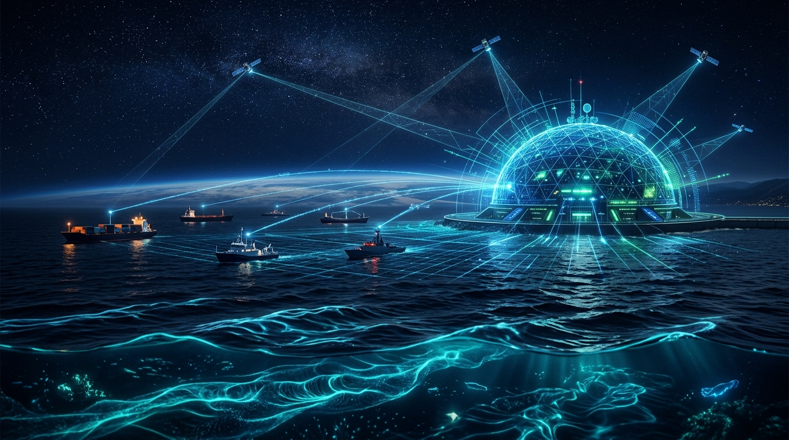

<p align="center">
  
</p>

<p align="center">
  <a href="#license-and-acknowledgments"></a>
  
  
  
  
</p>
<p align="center">
  <a href="#quick-start-and-installation"></a>
</p>
<p align="center">
  <a href="https://github.com/abhay-7-7-7/orca" target="_blank"></a>
  <a href="https://www.python.org" target="_blank"></a>
  <a href="https://fastapi.tiangolo.com/" target="_blank"></a>
  <a href="https://react.dev/" target="_blank"></a>
  <a href="https://www.typescriptlang.org/" target="_blank"></a>
  <a href="https://leafletjs.com/" target="_blank"></a>
</p>

---

# ORCA — Marine Ecosystem Reasoning with Collaborative Agents

> **An agentic, conversational, and geospatial decision-support platform empowering Indian fishermen and marine stakeholders with hazard-aware ocean navigation, live fishing zone intelligence, and proactive maritime safety.**

---

## Why ORCA Exists

India possesses an expansive **8,100 km coastline** where over **7 million people** depend directly or indirectly on marine fisheries. Yet, every single voyage into the sea is a high-stakes search problem plagued by extreme uncertainty:

1. **Deadly Last-Mile Communication Gaps**:
   - In Kerala alone, hundreds of fishermen have lost their lives or gone missing at sea over the past decade. During extreme events like *Cyclone Ockhi*, vessels were already out at sea when the weather system intensified faster than traditional bulletin broadcast cycles.
   - Lightning strikes claim over 2,000 lives annually across India. Marine authorities have acknowledged that the primary culprit is not a lack of meteorological detection, but a **last-mile communication and reasoning failure**.

2. **Invisible Borders and International Detentions**:
   - Hundreds of Indian fishermen regularly find themselves apprehended and detained in neighboring foreign waters (Sri Lanka, Pakistan, Bangladesh). There are **no physical markers or buoys in the open sea**; compliance with International Maritime Boundary Lines (IMBL) requires navigation tools that small-scale artisanal fishers simply do not possess.

3. **Fuel Wastage and Economic Toll**:
   - Searching blindly for catch consumes up to **30–40% of voyage operational costs** in diesel fuel alone. While premier scientific bodies like **INCOIS** produce world-class Potential Fishing Zone (PFZ) advisories, they have traditionally been disseminated as static bulletins or dense WebGIS portals that are difficult to interpret on a rocking vessel under intense sunlight.

### The Pitch Thesis:
> **The gap in marine fisheries is not a data-availability gap — it is a last-mile reasoning, synthesis, and trust gap.**
> India already possesses world-class satellite and meteorological observations from ISRO, INCOIS, and IMD. **ORCA builds the collaborative agent layer that fuses them into one explainable, conversational, and hazard-aware answer.**

---

## What ORCA Does

Instead of simply displaying raw map layers or acting as a passive weather dashboard, ORCA answers two critical questions every mariner asks before casting off:

> **"Where are the fish today, and what is the safest, fuel-efficient sea route to reach them right now?"**

```
 ┌────────────────────────────────────────────────────────────────────────┐
 │                           ORCA PLATFORM                                │
 ├─────────────────────────┬─────────────────────────┬────────────────────┤
 │    FISH INTELLIGENCE    │    SEA-SAFE ROUTING     │  PROACTIVE SAFETY  │
 │  - Satellite SST Fronts │  - Zero-Land Routes     │  - IMBL Geofencing │
 │  - Chlorophyll Hotspots │  - Cape Comorin Passage │  - Cyclone Buffers │
 │  - INCOIS PFZ Synthesis │  - Wave/Wind A* Overlay │  - Lightning Nudge │
 └─────────────────────────┴─────────────────────────┴────────────────────┘
```

---

## Key Capabilities and Everyday Use Cases

### 1. High-Yield Potential Fishing Zones (PFZ)
- Fuses **Sea Surface Temperature (SST)** thermal gradients with **Chlorophyll-a concentrations** to identify nutrient-rich upwelling zones where pelagic fish congregate.
- Assigns composite viability scores and provides exact GPS coordinates, distance, and direction from your home harbor.

### 2. Guaranteed Sea-Only Navigation (Zero Land Routes)
- Navigates vessels strictly through navigable marine waters using maritime graph densification and bathymetric ray-casting masks.
- When traveling between ports across peninsular India (for example, from **Kochi** on the west coast to **Thoothukudi** on the east coast), ORCA automatically navigates the deep-water maritime passage **around Cape Comorin (Kanyakumari)**, with zero waypoints on land.
- Dynamically penalizes high swell (>2.5m), storm winds (>30 km/h), head-currents, and cyclone radii.

### 3. Proactive Geofencing and Border Warning
- Continuously calculates vessel distance to the **Indian Exclusive Economic Zone (EEZ)** and **International Maritime Boundary Lines (IMBL)**.
- Alerts captains well before approaching foreign boundaries or restricted **Marine Protected Areas (MPAs)** like the Gulf of Mannar National Park, eliminating accidental cross-border detentions.

### 4. Multilingual and Voice-First Conversational AI
- Built for mariners of varying literacy levels: supports voice queries and multi-turn conversations in **Malayalam, Tamil, Hindi, Telugu, Kannada, Bengali, and English**.
- Does not just recite raw numbers — it explains the reasoning:
  > *"We chose Zone #3 because it has an 89% chlorophyll gradient, wave heights remain under 1.4m along the southern corridor, and the path stays 18 km clear of the IMBL."*
- Generates interactive, one-tap **Follow-Up Action Buttons** to guide the conversation naturally.

### 5. Live Condition Monitoring and Automatic Rerouting
- If ocean conditions deteriorate mid-voyage (for example, a squall intensifies or wave swell exceeds vessel safety thresholds), ORCA's background fusion engine flags the risk and automatically calculates an evasive sea-safe reroute.

---

## Who ORCA Is Built For

| Stakeholder | Primary Pain Point | How ORCA Solves It |
|---|---|---|
| **Artisanal & Mechanized Fishermen** | Fuel wasted hunting for fish; vulnerability to sudden storms and cross-border arrest. | One-tap voice queries in local languages, high-yield PFZ GPS targets, 20–30% fuel savings, and boundary alerts. |
| **Harbor Masters & Port Officers** | Disseminating daily safety clearances to thousands of registered crafts. | Live situational map displaying active offshore fleets, localized gale alerts, and departure recommendations. |
| **Disaster Management (SDMA / NDMA)** | Contacting vulnerable vessels ahead of rapid cyclonic intensification. | Real-time hazard radius modeling, automatic corridor warnings, and last-mile advisory broadcasts. |
| **Coast Guard & Marine Police** | High cost of search-and-rescue operations and preventing illegal border crossings. | Real-time vessel AIS monitoring, proactive geofence alerts, and precise search vector coordinates. |

---

## Architectural Philosophy: The Collaborative Agent Model

ORCA rejects the brittle monolith pattern. Instead, it is organized as a federation of **specialized, lightweight autonomous data agents** feeding a centralized **Spatial-Temporal Fusion Layer**:

```
                       [ Fisher / Marine User ]
                                  │
                       [ AI Conversational Bar ]
                     (Voice / Regional Languages)
                                  │
            ┌─────────────────────┴─────────────────────┐
            ▼                                           ▼
  [ Language & Intent Agent ]                 [ Mode Switcher ]
  (Bhashini ASR / Translation)             (AI Mode vs Manual Mode)
            │
            ▼
 ┌─────────────────────────────────────────────────────────────┐
 │               COLLABORATIVE DATA AGENTS                     │
 │  - Marine Weather Agent      - Cyclone & Disaster Agent     │
 │  - SST & Chlorophyll Agent   - Geofence & Boundary Agent    │
 │  - PFZ Synthesis Agent       - Lightning Cluster Agent      │
 │  - Vessel AIS Agent          - Tidal Phase Agent            │
 └──────────────────────────────┬──────────────────────────────┘
                                │
                                ▼
         ┌──────────────────────────────────────────────┐
         │     SPATIAL-TEMPORAL FUSION WORLD-STATE      │
         │ (Live Hazard Grid + Dynamic Cost Multipliers)│
         └──────────────────────┬───────────────────────┘
                                │
             ┌──────────────────┴──────────────────┐
             ▼                                     ▼
   [ Hazard-Aware Routing ]               [ Geospatial Visualizer ]
   (Sea-Safe Maritime A*)                (Leaflet Marine Canvas)
             │                                     │
             └──────────────────┬──────────────────┘
                                ▼
                 [ Interactive Unified Dashboard ]
```

- **Independent Resilience**: If an external satellite or weather service experiences downtime, only that specific layer's cell values degrade — the routing, geofencing, and chat systems continue functioning seamlessly with redundant fallbacks.
- **Single Source of Truth**: The chatbot reads the exact same live world-state numbers used to render the map and calculate routes.

---

## User Interface: Two Tailored Operating Modes

The interface has been structured to eliminate visual congestion while keeping advanced controls readily accessible:

### 1. AI Navigator Mode (Default)
- **Zero-Clutter Ocean Canvas**: Distracting demo tile watermarks and overlapping checkboxes are hidden by default, presenting a clean marine basemap.
- **Hero Conversational Prompt**: Positioned cleanly at the center, inviting natural language queries like *"Plan route from Kochi to Thoothukudi"* or *"Where should I fish near Vizhinjam tomorrow?"*
- **Dynamic Slide-to-Dock Animation**: As soon as a query is submitted, the prompt smoothly animates to a floating glass card in the top-left corner, while the map glides and zooms into the calculated sea route.
- **One-Tap First-Query Modal**: On your first navigation query, a sleek pop-up lets you toggle live ocean overlays (Wind Flow, Wave Swells, PFZ Zones, Hazard Alerts) with instant, real-time background map updates.

### 2. Manual Controls Mode
- Easily switched via the top curved pill slider: `[ AI Navigator | Manual Controls ]`.
- Provides traditional port-to-spot dropdowns, coordinate lat/lon pickers, map click-to-place tools, and granular layer visibility checkboxes for mariners who prefer direct hands-on control.
- Fully collapsible with a single click to maintain an unobstructed view of the sea.

---

## Quick Start and Installation

### Prerequisites
- **Python 3.11+**
- **Node.js 18+** and **npm**

### 1. Backend Setup
```bash
# Clone the repository
git clone https://github.com/abhay-7-7-7/orca.git
cd orca

# Install backend dependencies
pip install -r requirements.txt
pip install searoute

# (Optional) Configure environment keys in .env
cp .env.example .env

# Launch the FastAPI backend server
python -m uvicorn backend.api.main:app --reload --port 8000
```
*Backend will be live at `http://localhost:8000` (API Docs at `http://localhost:8000/docs`).*

### 2. Frontend Setup
```bash
# Open a new terminal in the project root
cd frontend

# Install UI dependencies
npm install

# Start the Vite development server
npm run dev
```
*Frontend will be running at `http://localhost:5173` (or `http://localhost:3000`).*

### 3. Verify the Maritime Routing
To test that the maritime routing engine navigates safely through the ocean without crossing land:
```bash
# Run the routing unit test suite
python -m pytest backend/tests/routing/test_routing.py -v
```

---

## The Horizon: V2 Predictive Roadmap

While ORCA V1 focuses on live data fusion, hazard-aware routing, and natural multilingual reasoning, the modular agent architecture is pre-designed to incorporate predictive models:

- **AI Fish Density Forecasting**: Moving from reactive PFZ alerts to 48-hour pelagic fish school trajectory forecasting based on sea surface temperature currents and historical catch distributions.
- **Low-Bandwidth Satellite / NavIC Link**: Packaging route coordinates and hazard alerts into compressed 140-character packets transmittable via ISRO's **NavIC** messaging receiver or satellite SOS dongles when boats sail beyond cellular range (>15–20 nautical miles offshore).
- **Fleet Co-op Alerts**: Peer-to-peer hazard sharing allowing fishing vessels to report localized squalls, floating debris, or lost nets to nearby boats in real time.

---

## License and Acknowledgments

- Built for **Smart India Hackathon (SIH 2026)** under the **ISRO / Department of Space** problem statement.
- Geospatial and marine data powered by open services from **INCOIS**, **Open-Meteo Marine**, **OpenSeaMap**, **NOAA CoastWatch**, **GDACS**, and the **Copernicus Marine Service**.
- Dedicated to the safety, prosperity, and dignity of India's coastal seafaring communities.
